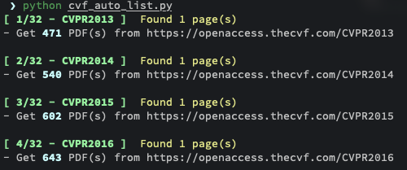
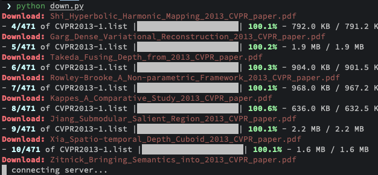

# Toolkit for CVF PDFs auto-download

**Completely auto** scripts for fetching PDF lists on [Computer Vision Foundation(CVF)](https://openaccess.thecvf.com/menu) and auto-download.

## Usage

Need python3.x, users from China may need VPN to accelerate.

Only 2 commands need to be run to get all what you want.

1. Use `cvf_auto-list.py` to get all pdf lists first, you can configure the parameters in the file.

2. Use `down.py` to download pdfs using lists you generated in the step-1. Notice that the download process would continue from last downloading file if terminated.

